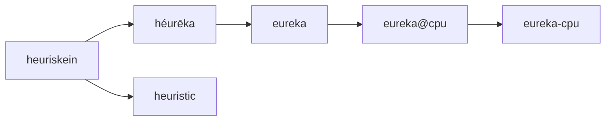

# whoami

## Name Origin

_eureka_ -- **/yəˈrēkə,yo͞oˈrēkə/**

An interjection used to celebrate a discovery or invention.

`eureka` is an alias I've used for many years, which originates from the ancient greek
word εὕρηκα (héurēka), and is a transliteration of an exclamation attributed to ancient
greek mathematician and inventor, _Archimedes_. _[[1]]_

Also worthy of note is the word "heuristic", which pertains to the process of gaining knowledge or
some desired result by intelligent guesswork rather than by following some preestablished formula.
The word "heuristic" can be contrasted with "algorithm", and is a sister word to héurēka, derived from heuriskein. _[[2]]_
One could make the correlation that working _heuristically_ leads to more "eureka" moments.

GitHub, GitLab and other git services convert the `@` symbol to a `-`, thus the username `eureka-cpu`
which is derived from the generic terminal prompt: `user@host`.

This can be summed up in short by the following flowchart:

[1]: <https://en.wikipedia.org/wiki/Eureka_(word)>
[2]: <https://www.techtarget.com/whatis/definition/heuristic#:~:text=As%20an%20adjective%2C%20heuristic%20(pronounced,be%20contrasted%20with%20algorithm%20ic.)>

## About

Eureka started as a band name for one of my musical projects, and it eventually became my go-to
alias when I dove into programming in January 2021. Before that, I was a full-time music instructor,
teaching at several after-school programs until the COVID-19 pandemic hit, wiping out most of my
income. That’s when I decided to make a major career switch to programming.

I began with Python and Java, then moved on to JavaScript, React, and a bunch of other frameworks,
but quickly realized it wasn't my thing. In October of that same year, I landed an internship at
Fuel Labs, working on the Sway compiler and tooling teams with Rust. That time was a huge turning
point for me, not just in terms of technical skills but also because I got to work alongside some
incredible developers who are still close friends today.

After six months as an intern, I was hired full-time, and it completely changed my life. I moved
into a townhouse, started supporting my friends, family, and my girlfriend of six years, who has
intractable epilepsy, and finally had the freedom to pursue my hobbies and business ideas.

I was living in Texas then, but after a few years and some other programming gigs, I managed to
move with my girlfriend to Washington, where we live now. I owe an unpayable debt to those
who've helped me along the way, and among those in particular, my dearest friend Alex Hansen,
who is always pushing me to be a better engineer and human being.
